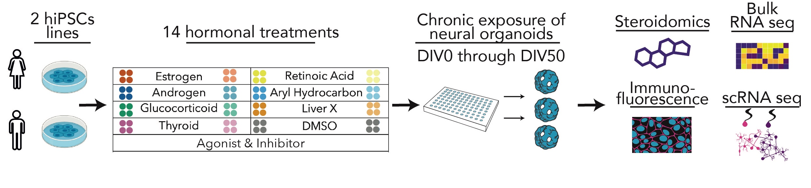
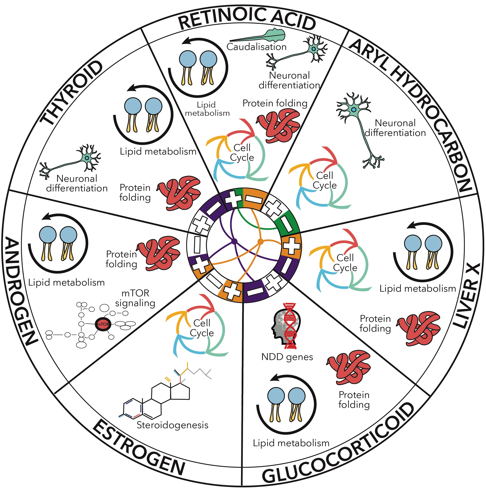

# Neural Organoid Hormonal Atlas (NOHA)

Repository for the [Neural Organoid Hormonal Atlas, bioRxiv](https://www.biorxiv.org/content/10.1101/2025.08.14.669814v1.full.pdf).

> A molecular cell atlas of endocrine signalling in human neural organoids 

## Abstract

Hormonal signalling shapes the development of the human brain and its disruption is implicated in various neuropsychiatric conditions. However, a comprehensive and mechanistic understanding of how hormonal pathways orchestrate human neurodevelopment remains elusive. Here we present a multi-scale high resolution atlas of endocrine signalling in human neural organoids through systematic perturbations with agonists and inhibitors of seven key hormonal pathways: androgen (AND), estrogen (EST), glucocorticoid (GC), thyroid (THY), retinoic acid (RA), liver X (LX), and aryl hydrocarbon (AH). By integrating bulk and single-cell transcriptomics, high-throughput imaging and targeted steroidomics, we mapped the molecular and cellular consequences of their physiologically relevant perturbations. Retinoic acid exerted the most profound effect, promoting neuronal differentiation and maturation, consistent with its established role as a patterning factor. Our analysis further benchmarked neural organoids for in vitro endocrinology and neurotoxicology by confirming previously reported in vivo effects, such as induction of mTOR signalling by AND, alteration of disease relevant genes by GC and enhanced differentiation by TH. Furthermore, we observed that LX activation upregulates genes involved in cholesterol metabolism while AH inhibition promotes neuronal differentiation. We next uncovered extensive crosstalks between these endocrine pathways, as in the paradigmatic convergence induced by AND agonist and inhibitors of GC, TH, and LX, affecting genes related to protein folding and metabolic regulation, as also highlighted by weighted gene co-expression network analysis. Single-cell analyses pinpointed cell-type-specific responses to hormonal challenges, such as the caudalization of progenitors and neurons upon RA activation and the depletion of specific neurodevelopmental states upon AH activation. Finally, we dissected the cytoarchitectural and morphometric impact of hormonal perturbations and demonstrated that neural organoids possess active steroidogenic pathways that are functionally modulated by the tested compounds. This atlas provides a systematic quantification of the hormonal impact on human neurodevelopment, enabling the investigation of uncharted aspects in the developmental origins of neuropsychiatric traits. Through the empowering architecture of its knowledge base for iterative adoption by the community, this resource will thus be key to probe how environmental factors and genetic endocrine vulnerabilities contribute to neurodevelopmental outcomes, as well as to train advanced generative models for improving their predictive power on gene environment interactions in human neurodevelopment. 

## Report Cards and Mining

Acknowledging the wealth and multi-scale nature of the data produced in this study, which integrates bulk and single-cell transcriptomics, high-throughput imaging, and targeted steroidomics, we have developed a public resource to ensure maximum accessibility and utility for the scientific community. 

For each of the seven hormonal pathways investigated, we provide a dedicated "report card" containing a schematic summary of the main observations drawn by our analyses. This allows fellow researchers to gain a rapid, high-level understanding of the key findings.

A more comprehensive asset complements this initial overview: a mining of the data organized in this public repository serving as a portal for deep data exploration, offering detailed descriptions of our results and, crucially, contextualizing them within the current body of scientific knowledge. This transforms our atlas from a static publication into a dynamic resource designed to be actively used, explored, and updated. While we have meticulously curated this initial release, we envision it as a living atlas that will evolve and improve in the future. This was elaborated as a collective effort distributed across scientists with different backgrounds and seniority. Consequently, even if the same structure with thematic sub-chapters was elaborated for each hormonal pathway, the level of details included for each pathway is still heterogeneous, mainly because the amount of available public literature is very different across pathways.  We plan to harmonise better the info included in the near future, and we hope the scientific community will contribute to it. 
Our vision is that this resource will foster further discoveries and provide a framework for investigating the impact of endocrine signalling in human neurodevelopment, and more broadly, the developmental origins of neuropsychiatric traits.

If you notice any typos or glitches, feel welcome to contact us to contribute and improve this resource.

The work is accessible [here](1_bulkRNASeq/7_DataMining/0.Index.md).

## Containers

- for the bulkRNAseq and steroidomics analyses it can be retrieved via `docker pull testalab/downstream:EndPoints-1.1.5`. R packages were versioned with renv and the renv.lock is available in this repo [here](renv.lock).
- for the scRNAseq analyses it can be retrieved via `docker pull alessiavalenti/sc:sc-noha-0.0.1`.
- for the imaging analyses it can be retrieved via `docker pull alessiavalenti/imaging:TMA-0.0.1`.

## html notebooks

An html version of the notebooks is accessible [here](https://giuseppetestalab.github.io/noha/).

## Code folders

* `1_bulkRNASeq`: codes and notebooks related to the bulk transcriptomic analysis.

* `2_scRNASeq`: codes and notebooks related to the single-cell transcriptomic analysis.

* `3_ImageAnalysis`: codes and notebooks related to the image analysis.

* `4_steroidomics`: codes and notebooks related to the targeted steroidomics analysis.

