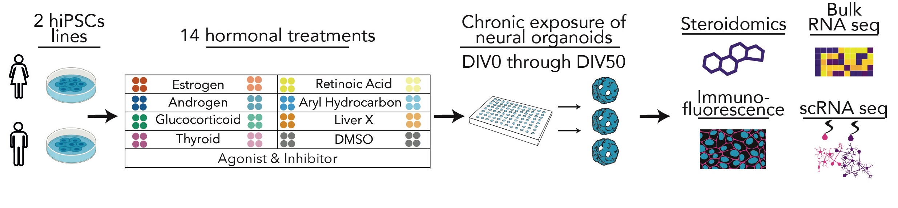
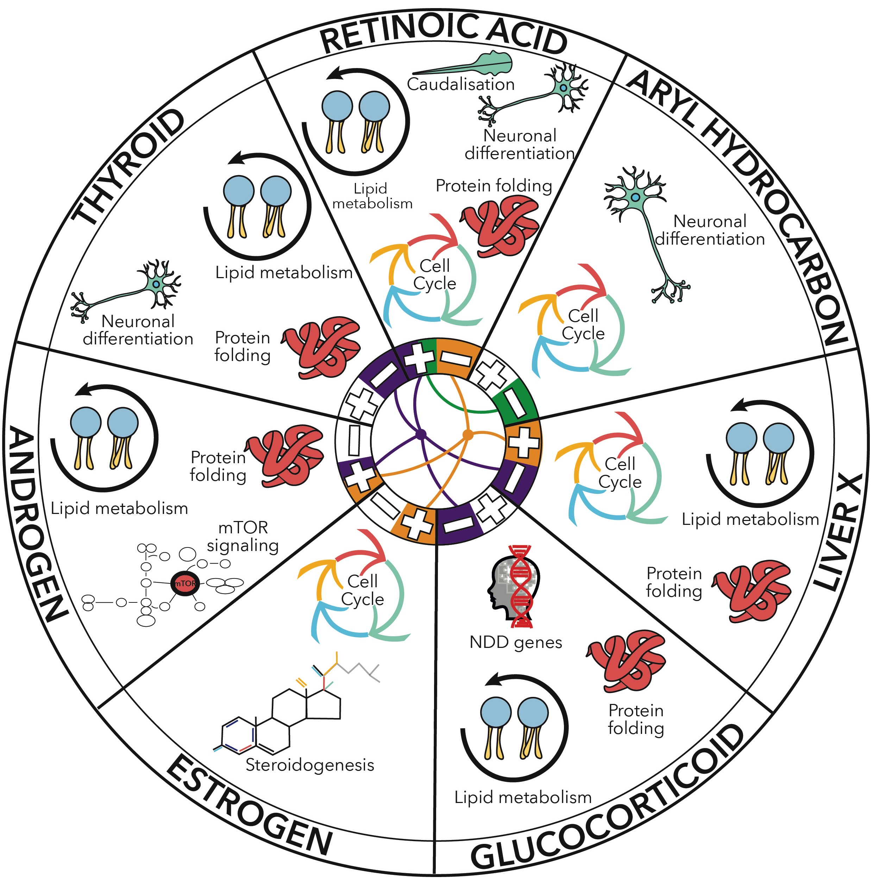

# Neural Organoid Hormonal Atlas 

Repository for the Neural Organoid Hormonal Atlas (NOHA): [A molecular cell atlas of endocrine signalling in human neural organoids.](https://doi.org/10.1016/j.cpblue.2026.100077)

Cite as: 
> Matassa, G. et al. A molecular cell atlas of endocrine signaling in human neural organoids. Cell Press Blue 1, 100077 (2026).

## Abstract

Hormonal signaling regulates human neurodevelopment, yet its cell-type-specific effects and interactions remain poorly understood. Here, we generated a multi-omic atlas of endocrine signaling by chronically exposing developing human neural organoids to agonists and inhibitors of seven endocrine pathways: androgen, estrogen, glucocorticoid, thyroid, retinoic acid, liver X, and aryl hydrocarbon. Integrating bulk and single-cell transcriptomics, high-throughput imaging, and targeted steroidomics, we mapped endocrine responses across molecular, cellular, and morphological scales. Retinoic acid signaling had the strongest impact, promoting caudalization, neuronal maturation, and altered organoid architecture. Across pathways, androgen activation and inhibition of glucocorticoid, thyroid, and liver X signaling converged on shared gene modules involved in lipid metabolism, proteostasis, and epigenetic regulation. Single-cell analyses identified cell-type-specific endocrine responses and hormone-associated developmental states, while steroidomics revealed pathway-dependent remodeling of steroid metabolism. Together, these data establish a reference atlas for investigating endocrine disorders, developmental neurotoxicity, and environmental endocrine disruption.

## Report Cards and Mining

Acknowledging the wealth and multi-scale nature of the data produced in this study, which integrates bulk and single-cell transcriptomics, high-throughput imaging, and targeted steroidomics, we have developed a public resource to ensure maximum accessibility and utility for the scientific community. 

For each of the seven hormonal pathways investigated, we provide a dedicated "report card" containing a schematic summary of the main observations drawn by our analyses. This allows fellow researchers to gain a rapid, high-level understanding of the key findings.

A more comprehensive asset complements this initial overview: a mining of the data organized in this public repository serving as a portal for deep data exploration, offering detailed descriptions of our results and, crucially, contextualizing them within the current body of scientific knowledge. This transforms our atlas from a static publication into a dynamic resource designed to be actively used, explored, and updated. While we have meticulously curated this initial release, we envision it as a living atlas that will evolve and improve in the future. This was elaborated as a collective effort distributed across scientists with different backgrounds and seniority. Consequently, even if the same structure with thematic sub-chapters was elaborated for each hormonal pathway, the level of details included for each pathway is still heterogeneous, mainly because the amount of available public literature is very different across pathways.  We plan to harmonise better the info included in the near future, and we hope the scientific community will contribute to it. 
Our vision is that this resource will foster further discoveries and provide a framework for investigating the impact of endocrine signalling in human neurodevelopment, and more broadly, the developmental origins of neuropsychiatric traits.

If you notice any typos or glitches, feel welcome to contact us to contribute and improve this resource.

The work is accessible [here](1_bulkRNASeq/7_DataMining/0.Index.md).

## Containers

- for the bulkRNAseq and steroidomics analyses it can be retrieved via `docker pull testalab/downstream:EndPoints-1.1.5`. R packages were versioned with renv and the renv.lock is available in this repo [here](renv.lock).
- for the scRNAseq analyses it can be retrieved via `docker pull alessiavalenti/sc:sc-noha-0.0.1`.
- for the imaging analyses it can be retrieved via `docker pull alessiavalenti/imaging:TMA-0.0.1`.

## html notebooks

An html version of the notebooks is accessible [here](https://giuseppetestalab.github.io/noha/).

## Code folders

*  `0_HormonalGenes`: codes and notebooks related to the exploratory analysis of hormone-related gene expressions in external bulk and single-cell transcriptomic datasets. 

* `1_bulkRNASeq`: codes and notebooks related to the bulk transcriptomic analysis.

* `2_scRNASeq`: codes and notebooks related to the single-cell transcriptomic analysis.

* `3_ImageAnalysis`: codes and notebooks related to the image analysis.

* `4_steroidomics`: codes and notebooks related to the targeted steroidomics analysis.

